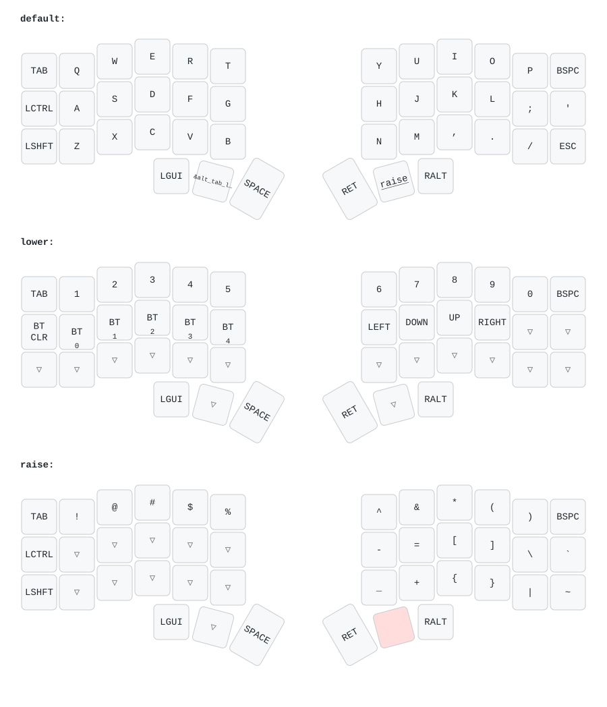

# TPS65 continuous RDY diagnostic, awake variant (based on #94)

Builds ONLY `corne_right_tps65_rdy_awake.uf2`. Keep the left firmware and
settings; do not flash settings_reset. Cursor movement is not expected:
this temporary diagnostic disables the normal TPS65 driver and split input.
Pin mapping, sensor diagnostic, dependencies and keymap are unchanged from #94.
For this right-half diagnostic, RGB automatic idle/USB shutoff and OLED
blanking on idle are disabled. Deep sleep remains disabled; idle timeout is
set to the maximum signed 32-bit value (2147483647 ms). Do not set it to zero:
ZMK v0.3.0 treats zero as immediate idle, not as disabling the idle timer.
The left half keeps its existing firmware and its own idle behavior.
RGB brightness/effect and external-power settings remain unchanged.
This eliminates the automatic idle shutoff variable; it does not prove that
shutoff caused the late RDY response seen in #94.
SDA P0.10 / SCL P0.09 remain open drain WITHOUT internal pull-ups.
NRST P1.04 and RDY P1.06 keep the existing mapping.

At five seconds the independent diagnostic thread holds reset for 100 ms,
tests independent SDA/SCL control (expected samples 3,1,2,3), releases reset
and polls RDY. After the initial two seconds, a low RDY no longer ends the
test: polling continues every millisecond without another reset. On the
first observed high it makes ONE product-identification transaction.
A failed line test or failed I2C transaction is not retried automatically.
This does not block the keyboard workqueue and does not write settings.

`GPIO_ID v3 monitor` reports the test outcome. `RDY_MON live` is a fresh
GPIO sample every five seconds; `waiting` indicates ongoing RDY polling;
`first_high_ms` is time from reset release to the first observed high (-1
means none); `since_reset_ms` is elapsed time since reset release, meaningful
only if stage 4 was reached. Stage 4 is waiting, 5 a RDY read error, 10-24
protocol operations, and 25 completion. Repeated GPIO_ID results describe
the same transaction; RDY_MON live is resampled even after it finishes.

The bounded software I2C transaction reads register 0x0000 at address 0x74,
checks SCL on every rise (up to 500 ms clock stretching, 2500 ms transaction
deadline), and sends B000 end-window command 0xEEEE. Lines are released on
exit. Product validity alone does not establish complete sensor health.
Tests exercise actual functions with simulated GPIO/time, including a high
RDY arriving after the original deadline, permanent low, GPIO read errors,
NACK, stretching and prevention of retries after line/protocol failure.

## Inherited diagnostic reference (#87; not active in this test)

This branch builds ONLY the right half: `corne_right_59_diagnostics.uf2`.
It uses the exact #59 base (0c94b3a615fe66d83a71b3fe8ddce138254aa59c), including
its pin routing, IQS5xx driver revision, RGB/OLED settings and split role.
The left half can keep #59. Do not flash settings_reset for this diagnostic.

Changes: enable USB serial logging, retain boot messages for 8 seconds and
print a diagnostic summary every 5 seconds. The USB product is named
`Corne TPS65 probe`. Its serial connection is for logs; the right still sends
keyboard and pointer events through the split to the left.

`TPS65_PROBE` reports driver readiness and cumulative trackpad event counts.
Only trackpad events are counted, not typed keyboard keys. `TPS65_PINS` and
`TPS65_PINCFG` read registers without reconfiguring pins or touching the I2C
bus. GPIO samples are not voltage measurements. The output latches do not
prove that the physical NRST/VCC pins have the expected voltage. Interpret IN
samples alongside PIN_CNF input connectivity. `NFCPINS` reports the actual
persistent NFC configuration, which can differ from the firmware's DTS.

Interpretation:
- ready=0: inspect the IQS5xx startup error; hardware initialization failed.
- ready=1, x/y counters increasing: driver produced pointer data on the right;
  investigate split transport/left processing next if the cursor remains still.
- ready=1, counters stay zero: inspect the RDY/I2C path; initialization alone is
  not proof of successful movement reporting.
- NFCPINS bit 0 = 1: NFC protection remains enabled; the pin configuration must
  be corrected before these pins can operate as normal GPIOs.

Connect the RIGHT USB with a data cable, open its serial port at 115200 baud
with DTR enabled, wait for the repeated summary, then move a finger and tap.
Capture about 30 seconds. The driver logs startup errors at error level. The
probe still reports readiness/counters even if the serial port missed boot.
Do not apply extra pull-ups, change wiring, erase settings or update the driver
as part of this observation; those require evidence from the results first.

The upstream general guide below is retained for reference. Its settings reset
advice does not apply to this diagnostic.

---

# Corne Keyboard Guide
This guide is for flashing the Ergomech Corne Keyboard. The Corne is 6×3+3 keys column-staggered split keyboard, using Cherry or Choc switches.

# ErgoMech Corne Wireless
The Ergomech Corne Wireless uses a Nice!Nano microcontroller and runs the ZMK firmware. This guide will show you how to flash the ZMK firmware to the Nice!Nano microcontroller.

## Default keymap
The default keymap of this keyboard can be found here:

## Flashing the Corne
The ZMK cli tool would typically have you step through several questions to generate the necessary code to flash the firmware then upload it to a new repository on GitHub.
However, Ergomech has already done this for you. You can find the repository [here](https://github.com/ergomechstore/corne-oled-zmk). Assuming you already have a GitHub account,
you can fork the repository, and make modifications to the keymap files in the future. For now, the guide will continue with the assumption that you have forked the repository.

### Running the Workflow
The repository has a GitHub workflow that leverages the zmkfirmware/zmk repository to build the firmware. The workflow will build the firmware and upload it as an artifact to the repository.
The workflow is triggered on push, pull_request, and manually via workflow_dispatch. You can trigger the workflow manually by going to the Actions tab in your forked repository and selecting the workflow.

### Workflow Artifact
Once the workflow has completed, you can download the artifact from the Actions tab. The artifact will be a .zip file that contains the firmware. Extract the .zip file in your
local directory. The extracted files will include:
- `corne_right-nice_nano_v2-zmk.uf2`
- `corne_left-nice_nano_v2-zmk.uf2`
- `settings_reset-nice_nano_v2-zmk.uf2`

### Flashing the keymap and firmware
#### Steps to ensure successful flashing
- Keep in mind that the power switch on the wireless Ergomech Corne is only **one** of the ways that the keyboard can be powered. The other way is to plug in the USB-C cable.
When flashing one side of the keyboard, the other side must be off. 
- The keyboard must be in bootloader mode to flash the firmware. To enter the bootloader mode, press the "BOOT" button twice in quick succession. 
- If you are having trouble flashing, you can always flash the `settings_reset-nice_nano_v2-zmk.uf2` file first. This is a good way to make sure 
that the keyboard is in a known state before flashing the firmware. The `reset` flash can be visually confirmed by the screen on the Nice!Nano microcontroller 
not displaying anything after the flash is complete.

#### Flashing Order
There is no required order to flash the firmware. You can flash the left or right side first. Assuming that you are attempting to flash the sides with the correct
file (i.e. the right side with the `corne_right-nice_nano_v2-zmk.uf2` file), you may find it helpful to follow the following order:
1. Confirm both sides of the keyboard are off.
2. Flash the right side of the keyboard, unplug the USB-C cable, and set it aside.
3. Flash the left side of the keyboard, leaving it plugged in after.
4. Turn on the right side of the keyboard. You should see the screen on the Nice!Nano microcontroller light up and display a checkmark next to the wifi icon if the sides have connected.
5. Open you favorite text editor and test the keyboard.

#### Flashing the firmware
1. Connect the keyboard to your computer via USB-C cable.
2. Press the "BOOT" button twice in quick succession to enter bootloader mode.
3. The keyboard should appear as a USB drive on your computer.
4. Drag and drop the `uf2` file that coincides with the side of the keyboard you are flashing onto the USB drive that represents the keyboard.
5. The keyboard will automatically reboot and the new firmware will be flashed.

**Note:** Some operating systems may show a failure when the keyboard reboots, or the USB drive may disappear. This is normal and the keyboard should be flashed successfully.
The keyboard flashing has been confirmed to work successfully on Windows 10, and Linux. 

## Modifying the keymap

### ZMK Keymap
We recommend at least reviewing the [ZMK Keymap documentation](https://zmk.dev/docs/features/keymaps) to understand the structure of the keymap files. This
will help you understand the changes we are making to the generated files. While not required, most example keymaps attempt to show the layout of the keyboard
shown as a comment underneath the layer declaration.

### ZMK Firmware
ZMK does provide an online [keymap editor](https://nickcoutsos.github.io/keymap-editor) and you can use this to change the keymap, this repo is already setup for the use of this editor.

#### Modifying the keymap with the keymap editor

#### Modifying the keymap manually
The exact spacing doesn't matter, but keeping the indentation consistent can be helpful for reading your keymap files. If you indent each button it will be easier
to confirm the structure of the keymap. Take a look at the [default keymap](config/corne.keymap) to see how this was done. 

The Ergomech Corne has a 5 way switch on the right side keyboard. The location of the key presses on the 5 way switch are on the last line of the `bindings` section of each layer.
As long as the correct number of entries exist on that row, the 5 way switch will work. 
